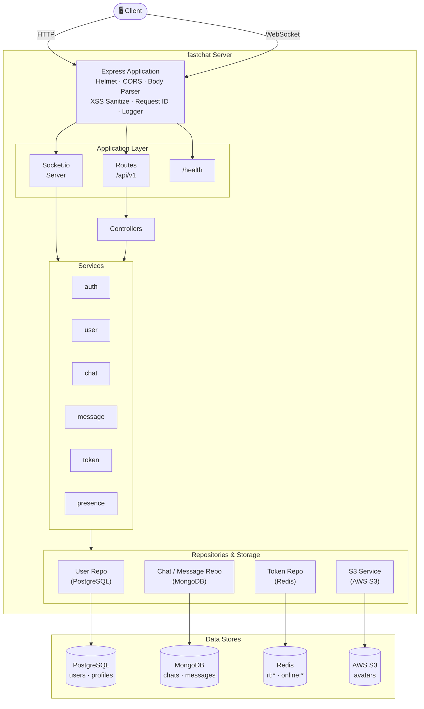
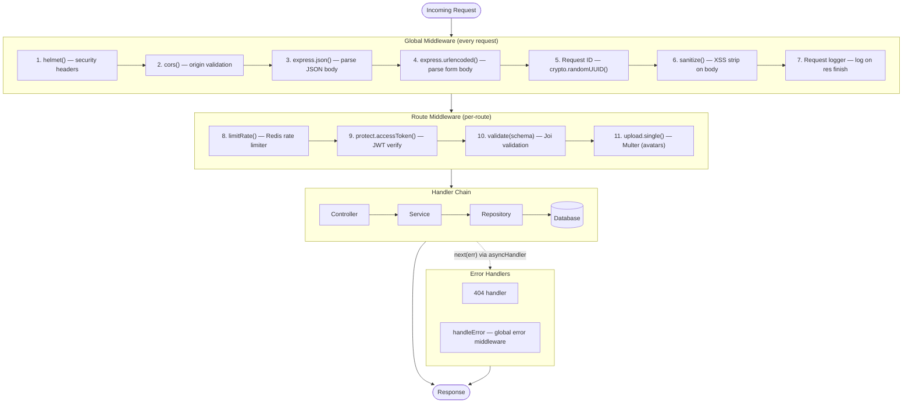
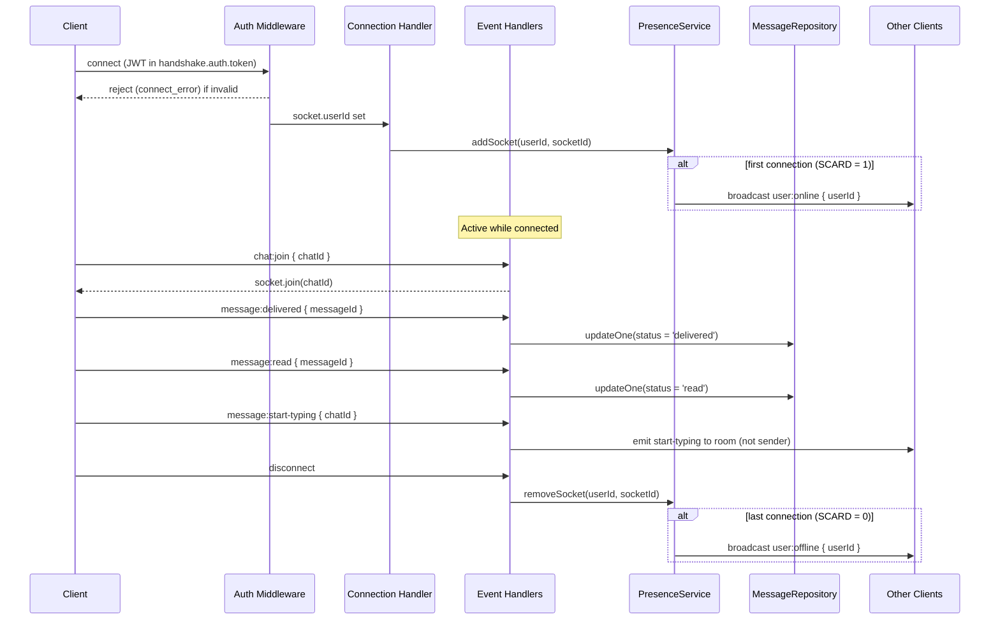
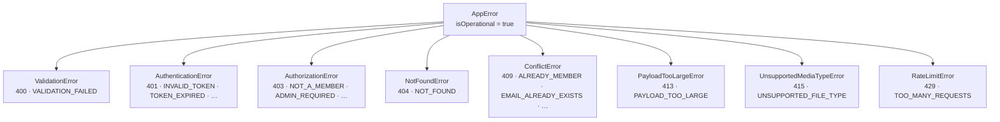

# Architecture Overview

System design, data flow, database schemas, and design patterns for fastchat.

---

## System Overview

fastchat uses **three purpose-built databases** plus optional **AWS S3** for file storage, each chosen for what it does best:

| Store           | Technology     | Role                                                                 |
| --------------- | -------------- | -------------------------------------------------------------------- |
| Relational data | PostgreSQL 16+ | Users, profiles, roles — ACID, strongly typed                        |
| Document store  | MongoDB 6.0+   | Chats and messages — flexible schema, easy iteration                 |
| In-memory cache | Redis 7.2+     | Refresh token sessions, online presence — TTL-native, sub-ms latency |
| Object storage  | AWS S3         | Avatar images — durable, served via public URL                       |

---

## High-Level Architecture



---

## Layered Architecture

The codebase enforces a strict one-way dependency chain. No layer may skip the one directly above it.

```
Routes → Controllers → Services → Repositories → Databases
```

| Layer                                  | Responsibility                                                                                  |
| -------------------------------------- | ----------------------------------------------------------------------------------------------- |
| **Routes** (`src/routes/`)             | Mount middleware and delegate to controllers. No logic.                                         |
| **Controllers** (`src/controllers/`)   | Extract validated fields from `req`, call one service method, wrap the result in `ApiResponse`. |
| **Services** (`src/services/`)         | All business rules. Call repositories. Throw typed `AppError` subclasses on violations.         |
| **Repositories** (`src/repositories/`) | Single-database concern. Return raw rows or documents. Assume input is already validated.       |
| **Databases**                          | PostgreSQL, MongoDB, Redis — accessed exclusively through their respective repositories.        |

**Exception:** `S3Service` is called directly by `UserService` rather than a repository, because S3 has no query interface — it is a side-effecting I/O operation, not a data store.

---

## Request Lifecycle



Errors thrown anywhere in the handler chain are caught by `asyncHandler` and forwarded to `handleError` via `next(err)`. Operational errors (`isOperational = true`) produce a structured JSON response. Unexpected errors produce a generic `INTERNAL_SERVER_ERROR` in production (with stack in development).

---

## Socket.io Architecture



### Multi-device Presence

`PresenceService` tracks every active socket per user in a Redis Set:

```
online:<userId>  →  Set { "socketId1", "socketId2", … }
```

- **First connect:** `SADD` returns `1` → broadcast `user:online`
- **Subsequent connects:** `SADD` returns `2+` → silent
- **Each disconnect:** `SREM` then check `SCARD` → broadcast `user:offline` only when count reaches `0`

This correctly handles users connected from multiple tabs or devices without spurious online/offline flicker.

---

## Worked Example: Sending a Message

```
POST /api/v1/chats/:chatId/messages
{ "content": "Hello!" }

  1. helmet, cors, body-parser, request-id, xss-sanitize
  2. Rate limit check (100 req / 15 min, Redis-backed)
  3. protect.accessToken → verify JWT → attach req.user
  4. validate(messageSchema) → confirm content ≤ 5000 chars, chatId is UUID
  5. MessageController.sendMessage(req, res)
  6.   → messageService.sendMessage(userId, chatId, content)
  7.      → chatRepository.findById(chatId) → confirm exists + user is participant
  8.      → messageRepository.create({ content, sender, chat, status: 'sent' })
  9.   → io.to(chatId).emit('message:new', formattedMessage)
  10.  → res.status(201).json(ApiResponse.success(...))

  Connected clients in the room receive 'message:new' in real-time (step 9).
  Recipient emits 'message:delivered' → status updated to 'delivered' in MongoDB.
  Recipient emits 'message:read' → status updated to 'read' in MongoDB.
```

---

## Worked Example: Uploading an Avatar

```
POST /api/v1/users/me/avatar
multipart/form-data, field: avatar

  1. multer (memory storage) → validate MIME type (jpeg/png/gif) and size (≤ 5 MB)
  2. protect.accessToken → verify JWT → attach req.user
  3. UserController.uploadAvatar(req, res)
  4.   → userService.updateAvatar(userId, file)
  5.      → userRepository.findById(userId) → get current avatar URL
  6.      → if old avatar exists: s3Service.deleteFile(oldUrl) [failure is logged, not fatal]
  7.      → s3Service.uploadFile(buffer, '<userId>-<timestamp>', mimetype)
  8.      → userRepository.updateById(userId, { avatar: newS3Url })
  9.   → res.status(200).json(ApiResponse.success({ user: { id, avatar: newS3Url } }))
```

---

## Database Schemas

### PostgreSQL — `users`

| Column          | Type          | Notes                                         |
| --------------- | ------------- | --------------------------------------------- |
| `id`            | `uuid`        | PK, `gen_random_uuid()`                       |
| `username`      | `varchar(20)` | unique, min 3 chars                           |
| `email`         | `text`        | unique                                        |
| `password_hash` | `text`        | bcrypt (cost 10)                              |
| `role`          | `user_role`   | enum: `'user'` \| `'admin'`; default `'user'` |
| `created_at`    | `timestamp`   | `now()`                                       |
| `updated_at`    | `timestamp`   | `now()`                                       |

### PostgreSQL — `profiles` (1:1 with users, `ON DELETE CASCADE`)

| Column       | Type        | Notes                          |
| ------------ | ----------- | ------------------------------ |
| `id`         | `uuid`      | PK                             |
| `user_id`    | `uuid`      | FK → `users.id`, unique        |
| `avatar`     | `text`      | nullable; full S3 URL when set |
| `bio`        | `text`      | nullable, max 200 chars        |
| `last_seen`  | `timestamp` | updated on socket disconnect   |
| `created_at` | `timestamp` | —                              |
| `updated_at` | `timestamp` | —                              |

A profile row is created automatically at signup.

### MongoDB — `chats` collection

```js
{
  _id:          String,    // crypto.randomUUID()
  type:         String,    // 'private' | 'group'
  groupName:    String,    // required when type === 'group'
  groupPicture: String,    // optional
  participants: [String],  // array of PostgreSQL user UUIDs
  admin:        String,    // user UUID; required when type === 'group'
  createdAt:    Date,
  updatedAt:    Date
}
```

Constraints: private chats must have exactly 2 participants; group chats must have at least 2.

Indexes: `{ participants: 1, createdAt: -1 }` · `{ participants: 1, type: 1 }` · `{ admin: 1 }`

### MongoDB — `messages` collection

```js
{
  _id:     String,   // crypto.randomUUID()
  content: String,   // required when type === 'text'; max 5000 chars
  status:  String,   // 'sent' | 'delivered' | 'read'; default 'sent'
  sender:  String,   // PostgreSQL user UUID
  chat:    String,   // chat _id
  type:    String,   // 'text' | 'file'; default 'text'
  file: {            // required when type === 'file'
    url:      String,
    filename: String,
    mimetype: String
  },
  createdAt: Date,
  updatedAt: Date
}
```

Indexes: `{ chat: 1, createdAt: -1 }` · `{ sender: 1, createdAt: -1 }` · `{ status: 1, chat: 1 }`

### Redis — Key Patterns

| Key               | Value              | TTL                                  | Purpose                        |
| ----------------- | ------------------ | ------------------------------------ | ------------------------------ |
| `rt:<token>`      | `<userId>` string  | `REFRESH_TOKEN_TTL`                  | Refresh token → userId lookup  |
| `online:<userId>` | Set of socket IDs  | none (managed by connect/disconnect) | Online presence                |
| `rl:auth:<ip>`    | rate-limit counter | per window                           | Auth endpoint rate limiting    |
| `rl:message:<ip>` | rate-limit counter | per window                           | Message endpoint rate limiting |

### AWS S3 — Avatars

```
Bucket: <S3_BUCKET_NAME>
Key:    <userId>-<timestamp>          e.g. "a1b2c3d4-1706000000000"
URL:    https://<bucket>.s3.<region>.amazonaws.com/<key>
```

The full URL is stored in `profiles.avatar` in PostgreSQL. When a user uploads a new avatar the old key is deleted first. Account deletion also deletes the avatar key (S3 failure on account deletion is non-fatal — it is logged but does not block the delete).

---

## Error Handling

### Error Class Hierarchy



### Error Response Shape

```json
{
  "success": false,
  "error": {
    "code": "VALIDATION_FAILED",
    "message": "Invalid request data",
    "details": [{ "path": "body.email", "message": "\"email\" must be a valid email" }]
  },
  "timestamp": "2024-01-01T00:00:00.000Z",
  "requestId": "550e8400-e29b-41d4-a716-446655440000"
}
```

Operational errors log at `warn` level. Unexpected programming errors log at `error` level and return a generic message in production (stack trace included in development).

---

## Design Patterns

### Repository Pattern

Each database concern is encapsulated in a class exposing a domain-oriented interface. Services never import DB clients directly. All repository instances are module-level singletons.

```
UserRepository     → PostgreSQL pool (`pg`)
ChatRepository     → Mongoose Chat model
MessageRepository  → Mongoose Message model
TokenRepository    → ioredis client
```

### `asyncHandler` Wrapper

Every async route handler is wrapped with `asyncHandler` so thrown errors are forwarded to the global error middleware via `next(err)` without boilerplate try/catch in every controller.

### Singleton Services

`presenceService`, `tokenService`, `s3Service`, and all repository instances are exported as plain module-level objects (created once on first `require`). The Socket.io server instance (`io`) is exposed via a Proxy that throws if accessed before `init()` is called — catching accidental use before the WebSocket server is ready.

---

## Graceful Shutdown

`server.js` registers handlers for `SIGTERM` and `SIGINT`:

1. Close the Socket.io server (stop accepting WebSocket connections)
2. Close the HTTP server (stop accepting HTTP connections, drain in-flight requests)
3. Disconnect MongoDB, close the PostgreSQL connection pool, quit Redis
4. Exit with code `0`

A 10-second forced-exit timeout kills the process if shutdown hangs. In-flight S3 requests are not explicitly drained — the AWS SDK aborts them when the process exits.

---

## See Also

- [REST API Reference](API_REST.md)
- [WebSocket API Reference](API_WEBSOCKET.md)
- [Testing Guide](TESTING.md)
- [Quick Start Guide](QUICKSTART.md)
