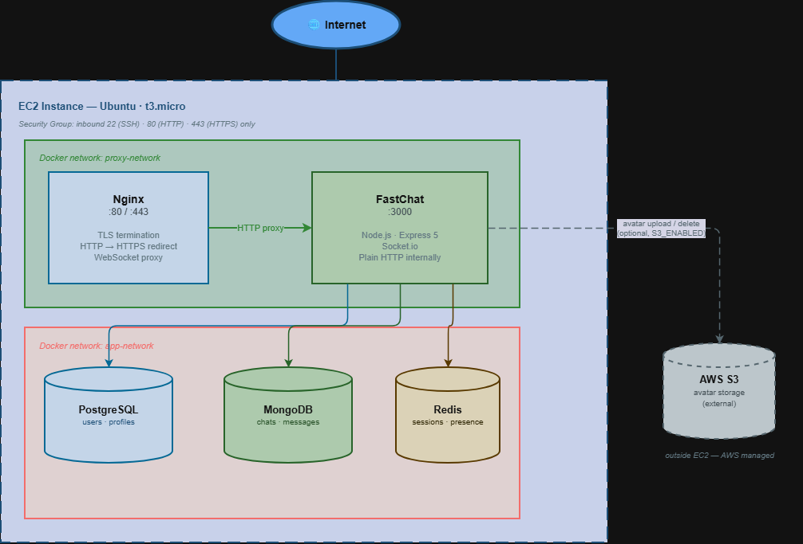

# Production Deployment

This document describes how fastchat is deployed and running in production. It covers both deployment environments, the infrastructure choices, network architecture, and lessons learned from the first deployment.

> For the full story behind the EC2 deployment — every mistake and how it was fixed — see: [How I Deployed My First Production App on AWS EC2 — Every Mistake I Made](https://dev.to/codephoenix86/how-i-deployed-my-first-production-app-on-aws-ec2-every-mistake-i-made-4e8e)

---

## Deployments

fastchat runs in two environments serving different purposes.

### Render — always-on (free tier)

**Live API:** `https://fastchat-u3tn.onrender.com` — verify with `GET /health`

| Component | Technology                   |
| --------- | ---------------------------- |
| Server    | Render (Docker deployment)   |
| Database  | Neon (PostgreSQL, free tier) |
| Cache     | Upstash (Redis, free tier)   |
| MongoDB   | MongoDB Atlas (free tier)    |

The Render deployment uses managed free-tier services (Neon, Upstash, MongoDB Atlas) and stays live permanently. It exists to keep a working API endpoint available without ongoing infrastructure cost.

### AWS EC2 — kept offline to avoid charges

> `https://fastchat.duckdns.org` — may be offline at any given time

| Component      | Technology                            |
| -------------- | ------------------------------------- |
| Server         | AWS EC2 (t3.micro, Ubuntu)            |
| Reverse proxy  | Nginx (Docker container)              |
| TLS            | Let's Encrypt via Certbot             |
| Domain         | DuckDNS (`fastchat.duckdns.org`)      |
| Containers     | Docker + Docker Compose               |
| Image registry | Docker Hub (`nareshlohar86/fastchat`) |

The EC2 deployment is a self-managed production stack built to demonstrate real infrastructure — Docker networking, Nginx as a reverse proxy, and Let's Encrypt SSL. It is spun up occasionally rather than kept running permanently to avoid AWS charges.

---

## Network Architecture

Two isolated Docker networks enforce trust boundaries:

- **proxy-network** — Nginx ↔ FastChat app only. The app never handles TLS or port management directly.
- **app-network** — FastChat app ↔ databases (PostgreSQL, MongoDB, Redis). Databases are never reachable from outside the EC2 instance.

Only ports 22 (SSH), 80 (HTTP), and 443 (HTTPS) are exposed to the internet.

---

## Key Infrastructure Decisions

**The app is agnostic to SSL and ports.** TLS termination, HTTP→HTTPS redirects, and port 443 are all handled by Nginx. The app only ever speaks plain HTTP internally on port 3000. This keeps the application code clean and makes it easy to swap the proxy layer if needed.

**Certbot is a one-shot container.** It runs once to issue the certificate, then exits. It is never included in `docker compose up -d` — doing so would cause it to attempt re-issuance on every restart. Renewal is triggered manually before the 90-day expiry.

**Service startup order matters.** The app containers (fastchat, postgres, mongo, redis) must be healthy before Nginx starts. Nginx resolves the app hostname at startup — if the app isn't up yet, Nginx fails to start. Similarly, the app must be running before Certbot runs its HTTP-01 challenge.

---

## What the Nginx Layer Handles

- TLS termination (Let's Encrypt certificate)
- HTTP → HTTPS redirect
- WebSocket upgrade headers (`Upgrade`, `Connection`) so Socket.io works over WSS
- Serving `/.well-known/acme-challenge/` from the Certbot webroot volume during cert issuance — this path is explicitly exempted from the HTTPS redirect

---

## Lessons Learned

These are the mistakes made during the first production deployment and what they taught:

| #   | What went wrong                                                                         | What I learned                                                                                     |
| --- | --------------------------------------------------------------------------------------- | -------------------------------------------------------------------------------------------------- |
| 1   | Ran Certbot before Nginx was up                                                         | Let's Encrypt HTTP-01 challenge needs an active HTTP server — start Nginx first                    |
| 2   | Forgot to add S3 credentials to `compose.yml` after switching from local storage        | Any code change involving external services must be reflected in the compose env vars              |
| 3   | Started Nginx before the app was ready                                                  | Nginx resolves the app hostname at startup — app must come first                                   |
| 4   | Duplicated `ssl_certificate` directive instead of pairing it with `ssl_certificate_key` | Config typos produce confusing errors — read Nginx config carefully before applying                |
| 5   | Skipped database migrations on fresh deployment                                         | Migrations don't run automatically — `npm run migrate:up` must be run explicitly on a new instance |
| 6   | HTTP→HTTPS redirect blocked the Let's Encrypt challenge                                 | `/.well-known/acme-challenge/` must be exempted from the redirect during cert issuance             |
| 7   | `docker compose up -d` kept restarting the one-shot Certbot container                   | Start services individually by name — not everything belongs in the default `up` target            |

---

## See Also

- [Architecture Overview](ARCHITECTURE.md)
- [Quick Start Guide](QUICKSTART.md)
- [REST API Reference](API_REST.md)
- [WebSocket API Reference](API_WEBSOCKET.md)
